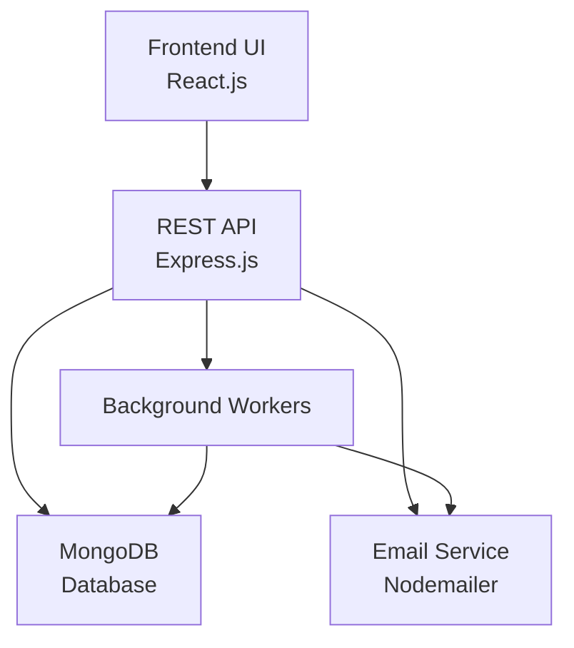

# XcelCrowd

A hiring pipeline management system that automates candidate tracking and queue management for engineering teams.

## Table of Contents

- [Overview](#overview)
- [Features](#features)
- [Requirements Mapping](#requirements-mapping)
- [Architecture](#architecture)
- [State Machine](#state-machine)
- [API Documentation](#api-documentation)
- [Installation](#installation)
- [Usage](#usage)
- [Testing](#testing)
- [Contributing](#contributing)

## Overview

### Problem
Engineering teams struggle with manual hiring pipeline management using spreadsheets, leading to poor visibility, inefficient processes, and missed opportunities.

### Solution
XcelCrowd automates hiring pipelines with:
- Configurable capacity limits per job
- Automatic queuing of overflow applicants
- Background promotion of waitlisted candidates
- Timed decay handling for inactive applications
- Complete audit trail of all state changes

### Technologies Used

- **Backend**: Node.js, Express.js
- **Database**: MongoDB with Mongoose ODM
- **Authentication**: JWT (JSON Web Tokens)
- **Email**: Nodemailer with SMTP support
- **Concurrency**: MongoDB transactions
- **Frontend**: React.js (optional UI)

## Features

- **Capacity Management**: Jobs have configurable capacity limits; excess applicants are queued
- **Automatic Promotion**: Waitlisted applicants are promoted to active status when slots open
- **Decay System**: Unacknowledged active slots decay back to waitlist with cooldown penalties
- **State Machine**: Robust applicant lifecycle with atomic state transitions
- **Concurrency Safety**: MongoDB transactions prevent race conditions in high-concurrency scenarios
- **Event Logging**: Complete audit trail of all applicant state changes
- **Role-Based Access**: Separate interfaces for companies and candidates
- **Email Notifications**: Automated shortlisting emails to candidates
- **RESTful API**: Well-documented endpoints with JWT authentication
- **Background Processing**: Automated decay and promotion workers

## Requirements Mapping

The system directly addresses the backend engineering challenge requirements:

| Requirement | Implementation |
|-------------|----------------|
| Queue systems | MongoDB-based queue with `queuePosition` and `nextQueuePosition` |
| Concurrency | MongoDB transactions with atomic `$inc` operations and conditional updates |
| API design | RESTful endpoints with JWT authentication and role-based middleware |
| Database design | Normalized schema with indexes on `jobId`, `queuePosition`, and timestamps |
| Capacity limits | `capacity` field on jobs with `activeCount` tracking |
| Automatic queuing | `applyService.js` atomically claims slots or queues applicants |
| Promotion logic | `promotionService.js` runs after exits/decays to fill available slots |
| Inactivity handling | `decayService.js` with 5-minute ack windows and 5-minute cooldowns |
| Transition logging | `Event` model records all state changes with timestamps |

## Architecture

### System Architecture



### Text-Based Architecture Overview

```
┌─────────────────┐    ┌─────────────────┐    ┌─────────────────┐
│   Frontend UI   │    │   REST API      │    │   Background    │
│   (React.js)    │◄──►│   (Express.js)  │◄──►│   Workers       │
└─────────────────┘    └─────────────────┘    └─────────────────┘
                              │                        │
                              ▼                        ▼
                       ┌─────────────────┐    ┌─────────────────┐
                       │   MongoDB       │    │   Email Service │
                       │   Database      │    │   (Nodemailer)  │
                       └─────────────────┘    └─────────────────┘
```

### Project Structure

```
xcelcrowd/
├── client/                 # React frontend (optional)
│   ├── src/
│   │   ├── components/
│   │   ├── pages/
│   │   └── utils/
│   └── package.json
├── server/                 # Express backend
│   ├── config/
│   │   ├── db.js          # Database connection
│   │   └── mailer.js      # Email configuration
│   ├── controllers/
│   │   ├── authController.js
│   │   └── jobController.js
│   ├── middleware/
│   │   ├── authMiddleware.js
│   │   └── roleMiddleware.js
│   ├── models/
│   │   ├── User.js
│   │   ├── Job.js
│   │   ├── Applicant.js
│   │   └── Event.js
│   ├── routes/
│   │   ├── authRoutes.js
│   │   └── jobRoutes.js
│   ├── services/
│   │   ├── applyService.js
│   │   ├── transitionService.js
│   │   ├── promotionService.js
│   │   └── decayService.js
│   ├── jobs/
│   │   └── worker.js      # Background job processor
│   ├── server.js          # Main application entry
│   └── package.json
└── README.md
```

### Models

#### Job
```javascript
{
  title: String,
  capacity: Number, // Max active applicants
  activeCount: Number, // Current active count
  status: "OPEN" | "CLOSED",
  nextQueuePosition: Number, // Next queue position to assign
  companyId: ObjectId // Reference to User
}
```

#### Applicant
```javascript
{
  jobId: ObjectId,
  name: String,
  email: String,
  status: "WAITLISTED" | "PROMOTION_IN_PROGRESS" | "ACTIVE_PENDING_ACK" | "ACTIVE_CONFIRMED" | "EXITED",
  queuePosition: Number, // Null when active
  ackDeadline: Date, // 5-minute window for ACTIVE_PENDING_ACK
  cooldownUntil: Date // Penalty period after decay
}
```

#### Event
```javascript
{
  applicantId: ObjectId,
  jobId: ObjectId,
  fromState: String,
  toState: String,
  reason: String,
  timestamp: Date
}
```

### Services

- **applyService.js**: Handles job applications with atomic slot claiming
- **transitionService.js**: Manages all state transitions with capacity updates
- **promotionService.js**: Automatically promotes waitlisted applicants
- **decayService.js**: Processes expired acknowledgments with penalties

### Flow

1. **Application**: Candidate applies → atomic slot check → ACTIVE_PENDING_ACK or WAITLISTED
2. **Acknowledgment**: Within 5 minutes → ACTIVE_CONFIRMED, else → decay
3. **Exit**: Company exits active applicant → trigger promotion
4. **Promotion**: Background process fills available slots from waitlist
5. **Decay**: Background process moves expired pending applicants back to queue

## State Machine

```
WAITLISTED ─────────────── Promotion ───────────────► PROMOTION_IN_PROGRESS ────► ACTIVE_PENDING_ACK
     ▲                                                                 │
     │                                                                 │
     └─────────────────────────────── Decay ───────────────────────────┘
                                               │
                                               ▼
                                     ACTIVE_CONFIRMED ──── Exit ────► EXITED
```

**Transitions**:
- **WAITLISTED → PROMOTION_IN_PROGRESS**: Automatic promotion when slots available
- **PROMOTION_IN_PROGRESS → ACTIVE_PENDING_ACK**: Successful promotion with 5-minute ack window
- **ACTIVE_PENDING_ACK → ACTIVE_CONFIRMED**: Candidate acknowledgment within deadline
- **ACTIVE_PENDING_ACK → WAITLISTED**: Decay timeout with 5-minute cooldown penalty
- **ACTIVE_* → EXITED**: Manual exit by company, triggers promotion

## Concurrency Handling

The system uses MongoDB transactions to ensure data consistency in high-concurrency scenarios:

- **Atomic Slot Claims**: Only one applicant can claim an available slot at a time
- **Transactional State Changes**: All applicant transitions are atomic
- **Safe Promotion**: Sequential processing prevents race conditions during promotion
- **Cooldown Tracking**: Prevents immediate re-promotion after decay

## API Documentation

### Authentication
All endpoints require JWT token in `Authorization: Bearer <token>` header.

### Base URL
```
http://localhost:5000
```

### Endpoints

#### Auth
- `POST /auth/signup` - User registration
- `POST /auth/login` - User login
- `GET /auth/me` - Get current user
- `PUT /auth/profile` - Update user profile

#### Jobs
- `POST /jobs` - Create job (Company only)
- `GET /jobs` - List company's jobs (Company only)
- `GET /jobs/open` - List open jobs (Candidate only)
- `POST /jobs/:id/close` - Close job (Company only)

#### Applications
- `POST /jobs/:id/apply` - Apply to job (Candidate only)
- `GET /jobs/applications/me` - List user's applications (Candidate only)
- `GET /jobs/:id/pipeline` - View job pipeline (Company only)
- `POST /jobs/applicant/:id/exit` - Exit applicant (Company only)
- `POST /jobs/applicant/:id/force-promote` - Force promote waitlisted applicant (Company only)
- `POST /jobs/applicant/:id/acknowledge` - Acknowledge active slot (Candidate only)
- `GET /jobs/applications/:id/events` - Get applicant events (Authorized users only)

### Example API Usage

#### Create a Job (Company)
```bash
curl -X POST http://localhost:5000/jobs \
  -H "Authorization: Bearer YOUR_JWT_TOKEN" \
  -H "Content-Type: application/json" \
  -d '{
    "title": "Senior Backend Engineer",
    "capacity": 5,
    "description": "We are looking for...",
    "location": "Remote",
    "requirements": "5+ years experience..."
  }'
```

**Response:**
```json
{
  "success": true,
  "data": {
    "id": "507f1f77bcf86cd799439011",
    "title": "Senior Backend Engineer",
    "capacity": 5,
    "activeCount": 0,
    "status": "OPEN",
    "companyId": "507f1f77bcf86cd799439012",
    "createdAt": "2024-01-15T10:30:00.000Z"
  }
}
```

#### Apply to a Job (Candidate)
```bash
curl -X POST http://localhost:5000/jobs/JOB_ID/apply \
  -H "Authorization: Bearer YOUR_JWT_TOKEN" \
  -H "Content-Type: application/json" \
  -d '{
    "name": "John Doe",
    "resume": {
      "fileName": "resume.pdf",
      "fileType": "application/pdf",
      "fileSize": 1024000,
      "dataUrl": "data:application/pdf;base64,..."
    }
  }'
```

**Response:**
```json
{
  "success": true,
  "data": {
    "id": "507f1f77bcf86cd799439013",
    "jobId": "507f1f77bcf86cd799439011",
    "name": "John Doe",
    "email": "john@example.com",
    "status": "ACTIVE_PENDING_ACK",
    "queuePosition": null,
    "ackDeadline": "2024-01-15T10:35:00.000Z"
  },
  "message": "Application submitted successfully. You have 5 minutes to acknowledge."
}
```

## Installation

### Prerequisites
- Node.js 18+ ([Download](https://nodejs.org/))
- MongoDB 4.4+ ([Download](https://www.mongodb.com/try/download/community))
- Git ([Download](https://git-scm.com/))

### Backend Setup

1. **Clone the repository**
   ```bash
   git clone https://github.com/yourusername/xcelcrowd.git
   cd xcelcrowd
   ```

2. **Install backend dependencies**
   ```bash
   cd server
   npm install
   ```

3. **Environment Configuration**
   ```bash
   cp .env.example .env
   ```

   Edit `.env` with your configuration:
   ```env
   # Server
   PORT=5000
   JWT_SECRET=your-super-secret-jwt-key-here
   MONGO_URI=mongodb://localhost:27017/xcelcrowd

   # Email (optional)
   SMTP_HOST=smtp.gmail.com
   SMTP_PORT=587
   SMTP_USER=your-email@gmail.com
   SMTP_PASS=your-app-password
   MAIL_FROM=XcelCrowd <noreply@xcelcrowd.com>
   ```

4. **Start MongoDB**
   ```bash
   # Using MongoDB service (Linux/Mac)
   sudo systemctl start mongod

   # Or using brew (Mac)
   brew services start mongodb-community

   # Or using Docker
   docker run -d -p 27017:27017 --name mongodb mongo:latest
   ```

5. **Run the backend**
   ```bash
   # Development mode
   npm run dev

   # Production mode
   npm start
   ```

### Frontend Setup (Optional)

1. **Install frontend dependencies**
   ```bash
   cd ../client
   npm install
   ```

2. **Start the frontend**
   ```bash
   npm start
   ```

The application will be available at:
- Backend API: http://localhost:5000
- Frontend UI: http://localhost:3000

## Usage

### Quick Start

1. **Register as a Company**
   ```bash
   curl -X POST http://localhost:5000/auth/signup \
     -H "Content-Type: application/json" \
     -d '{
       "name": "TechCorp Inc",
       "email": "hr@techcorp.com",
       "password": "securepassword",
       "role": "COMPANY"
     }'
   ```

2. **Create a Job**
   ```bash
   curl -X POST http://localhost:5000/jobs \
     -H "Authorization: Bearer COMPANY_JWT_TOKEN" \
     -H "Content-Type: application/json" \
     -d '{
       "title": "Software Engineer",
       "capacity": 3,
       "description": "Join our team..."
     }'
   ```

3. **Register as a Candidate**
   ```bash
   curl -X POST http://localhost:5000/auth/signup \
     -H "Content-Type: application/json" \
     -d '{
       "name": "Jane Developer",
       "email": "jane@example.com",
       "password": "securepassword",
       "role": "CANDIDATE"
     }'
   ```

4. **Apply to Jobs**
   ```bash
   curl -X POST http://localhost:5000/jobs/JOB_ID/apply \
     -H "Authorization: Bearer CANDIDATE_JWT_TOKEN" \
     -H "Content-Type: application/json" \
     -d '{
       "name": "Jane Developer"
     }'
   ```

### Background Processing

The system automatically runs background jobs every 5 seconds to:
- Process decayed applicants
- Promote waitlisted candidates

Monitor the console output for background job activity.

## Demo

### Local Demo Setup
To see XcelCrowd in action, follow the installation steps above and run the application locally.

### Demo Script
```bash
# 1. Start the server
npm run dev

# 2. Register a company
curl -X POST http://localhost:5000/auth/signup \
  -H "Content-Type: application/json" \
  -d '{"name":"DemoCorp","email":"hr@demo.com","password":"demo123","role":"COMPANY"}'

# 3. Create a job
curl -X POST http://localhost:5000/jobs \
  -H "Authorization: Bearer [COMPANY_TOKEN]" \
  -H "Content-Type: application/json" \
  -d '{"title":"Demo Engineer","capacity":2}'

# 4. Register candidates and apply
# (Multiple applications to see queuing and promotion)
```

## Testing

### Running Tests

```bash
# Backend tests
cd server
npm test

# Frontend tests
cd client
npm test
```

### Manual Testing

1. **API Testing with Postman/Insomnia**
   - Import the API collection from `docs/postman_collection.json`
   - Set environment variables for base URL and tokens

2. **Concurrency Testing**
   ```bash
   # Use tools like Apache Bench or wrk for load testing
   ab -n 1000 -c 10 http://localhost:5000/jobs/open
   ```

3. **Database Testing**
   - Use MongoDB Compass to inspect collections
   - Monitor transaction logs for concurrency issues

### Test Coverage

Planned test coverage includes:
- Unit tests for services
- Integration tests for API endpoints
- Concurrency stress tests

## Architectural Decisions, Tradeoffs, and Future Improvements

For detailed analysis of architectural decisions, tradeoffs made, and future improvements, see [ARCHITECTURE.md](ARCHITECTURE.md).

### Key Technical Features

- **Concurrency Safety**: MongoDB transactions prevent race conditions
- **Atomic Operations**: Database-level atomicity for slot claiming
- **Service Architecture**: Clean separation of business logic
- **State Management**: Robust applicant lifecycle with 5 states
- **Background Processing**: Automated promotion and decay handling

## Performance

### Key Metrics
- **Concurrency**: Handles multiple simultaneous applications with MongoDB transactions
- **Response Time**: Fast API responses for job applications and status updates
- **Background Processing**: Automated promotion/decay cycles every 5 seconds
- **Data Integrity**: Atomic operations ensure consistency under load

### Scalability Notes
- Designed for moderate traffic with proper database indexing
- Single worker process suitable for small to medium teams
- Can be scaled horizontally with additional worker processes

## Contributing

### Development Setup
1. Fork the repository
2. Create a feature branch: `git checkout -b feature/your-feature-name`
3. Make your changes and test locally
4. Commit your changes: `git commit -am 'Add some feature'`
5. Push to the branch: `git push origin feature/your-feature-name`
6. Submit a pull request

### Guidelines
- Follow existing code style and patterns
- Add tests for new features when possible
- Update documentation for API changes
- Ensure all tests pass before submitting

### Reporting Issues
- Use GitHub Issues to report bugs
- Include steps to reproduce the issue
- Provide environment details (Node.js version, MongoDB version)

## Contact

- **Project Maintainer**: Y.Laxmikanth
- **Email**: laxmikanthyaga@gmail.com
- **GitHub**: [@YLaxmikanth](https://github.com/YLaxmikanth)

---

**XcelCrowd** - Automating hiring pipelines, one applicant at a time.
